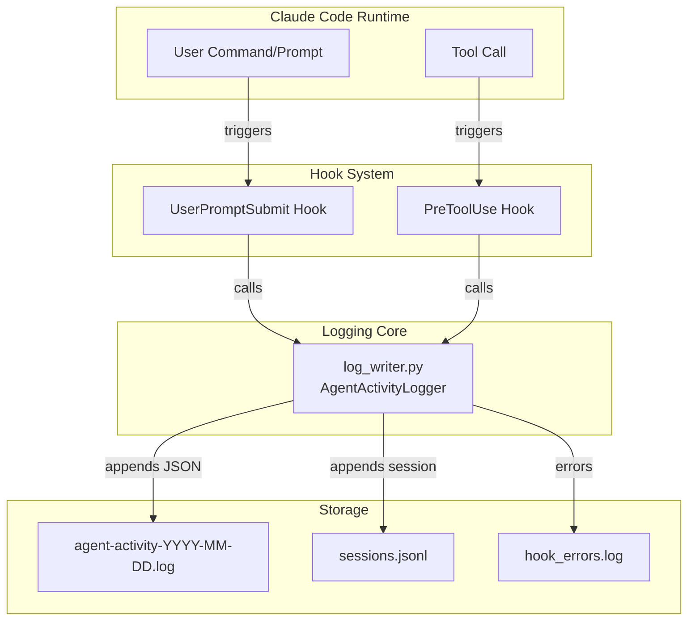
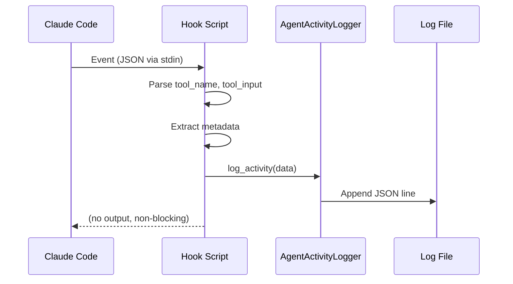
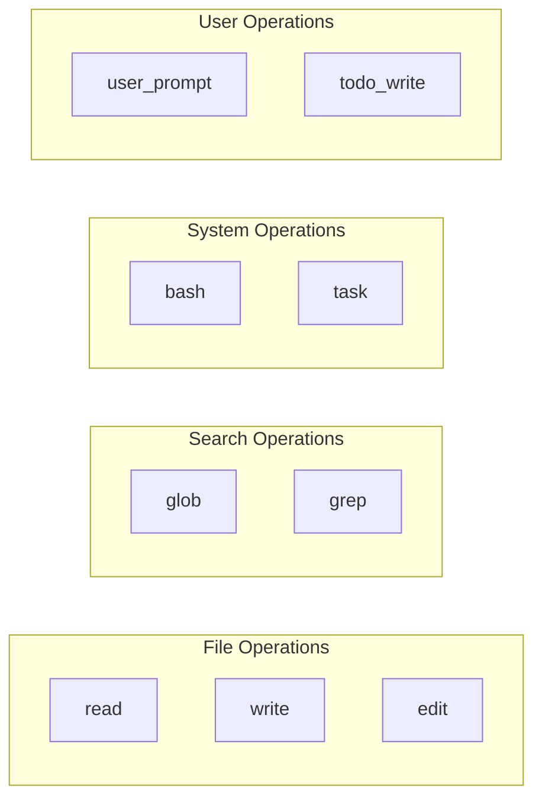
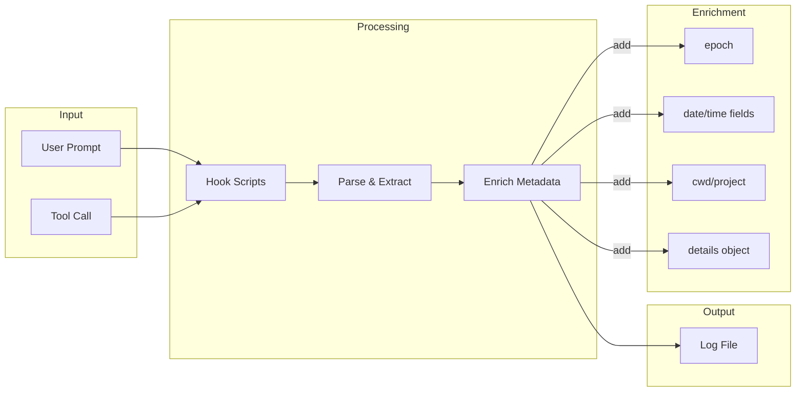

# Claude Code Activity Logging System

## Overview

An automatic activity logging system that captures all Claude Code tool operations and user prompts without manual intervention. Designed for session reconstruction, debugging, and agent context priming.

## Architecture



## Component Details

### 1. Hook Scripts

Hooks intercept Claude Code events before execution:



| Hook | Trigger | Captures |
|------|---------|----------|
| `user-prompt-submit.py` | User sends message | Prompt text, length |
| `pre-tool-use.py` | Before any tool runs | Tool name, parameters, file paths |

### 2. Log Writer (`log_writer.py`)

Core logging engine with these responsibilities:

- **Daily log rotation**: `agent-activity-YYYY-MM-DD.log`
- **JSON Lines format**: One complete JSON object per line
- **Session tracking**: Consolidated `sessions.jsonl`
- **Error isolation**: Failures logged to `hook_errors.log`

### 3. Storage Format

```
.claude/logs/
├── agent-activity-2025-12-09.log   # Activity log (JSON Lines)
├── agent-activity-2025-12-10.log   # New file per day
├── sessions.jsonl                   # Session metadata
└── hook_errors.log                  # Error log
```

## Log Entry Schema

Each log entry contains precomputed fields for efficient querying:

```json
{
  "epoch": 1733839514,
  "date": "2025-12-10",
  "year": 2025,
  "month": 12,
  "day": 10,
  "hour": 14,
  "timestamp": "2025-12-10T14:25:14.123456Z",
  "time": "14:25:14",
  "operation": "bash",
  "prompt": "List directory contents",
  "session_id": "session-20251210-142514-a1b2c3d4",
  "cwd": "/path/to/project",
  "project": "my-project",
  "details": {
    "tool_name": "Bash",
    "command": "ls -la",
    "description": "List directory contents"
  }
}
```

### Field Reference

| Field | Type | Purpose |
|-------|------|---------|
| `epoch` | int | Unix timestamp for time-range queries |
| `date` | str | Daily filtering (`YYYY-MM-DD`) |
| `year`, `month`, `day`, `hour` | int | Aggregation without parsing |
| `timestamp` | str | Full ISO 8601 UTC timestamp |
| `operation` | str | Operation type (read, write, bash, grep, etc.) |
| `prompt` | str | Human-readable description |
| `cwd` | str | Working directory |
| `project` | str | Project name |
| `details` | obj | Tool-specific metadata |

### Operation Types



## Query Examples

```python
import json
import time

def load_logs(filepath):
    with open(filepath, 'r') as f:
        return [json.loads(line) for line in f if line.strip()]

logs = load_logs('.claude/logs/agent-activity-2025-12-10.log')

# Last hour
cutoff = time.time() - 3600
recent = [e for e in logs if e['epoch'] > cutoff]

# Today's bash commands
bash_ops = [e for e in logs if e['operation'] == 'bash']

# Files edited this session
edits = [e['details']['file_path'] for e in logs
         if e['operation'] == 'edit' and 'details' in e]

# Activity by hour
from collections import Counter
hourly = Counter(e['hour'] for e in logs)
```

## Data Flow



## Configuration

Located at `.claude/hooks/auto-logger-config.json`:

```json
{
  "enabled": true,
  "log_tool_operations": true,
  "log_user_prompts": true,
  "log_level": "info",
  "max_prompt_length": 500,
  "session_tracking": true,
  "log_directory": "logs"
}
```

## Hook Registration

Hooks are registered in `.claude/settings.local.json`:

```json
{
  "hooks": {
    "PreToolUse": [{
      "hooks": [{
        "type": "command",
        "command": "python .claude/hooks/pre-tool-use.py"
      }]
    }],
    "UserPromptSubmit": [{
      "hooks": [{
        "type": "command",
        "command": "python .claude/hooks/user-prompt-submit.py"
      }]
    }]
  }
}
```

## Performance Characteristics

- **Latency**: <5ms per hook invocation
- **Storage**: ~500 bytes per log entry
- **Daily rotation**: Automatic, no manual cleanup needed
- **Error handling**: Non-blocking, failures don't interrupt Claude Code

## Use Cases

1. **Session Reconstruction**: Load recent logs to prime new agent with context
2. **Debugging**: Trace what operations led to an issue
3. **Analytics**: Understand tool usage patterns
4. **Audit Trail**: Record of all operations performed

## File Structure

```
.claude/
├── hooks/
│   ├── log_writer.py           # Core logging engine
│   ├── pre-tool-use.py         # Tool operation capture
│   ├── user-prompt-submit.py   # User prompt capture
│   └── auto-logger-config.json # Configuration
├── logs/
│   ├── agent-activity-*.log    # Daily activity logs
│   ├── sessions.jsonl          # Session metadata
│   └── hook_errors.log         # Error log
└── settings.local.json         # Hook registration
```
