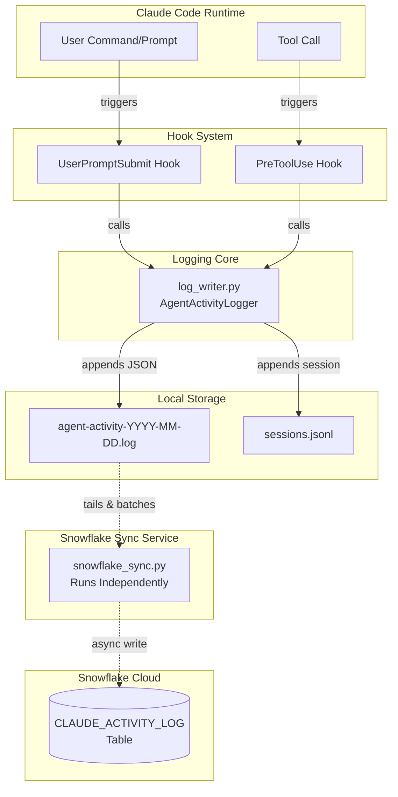
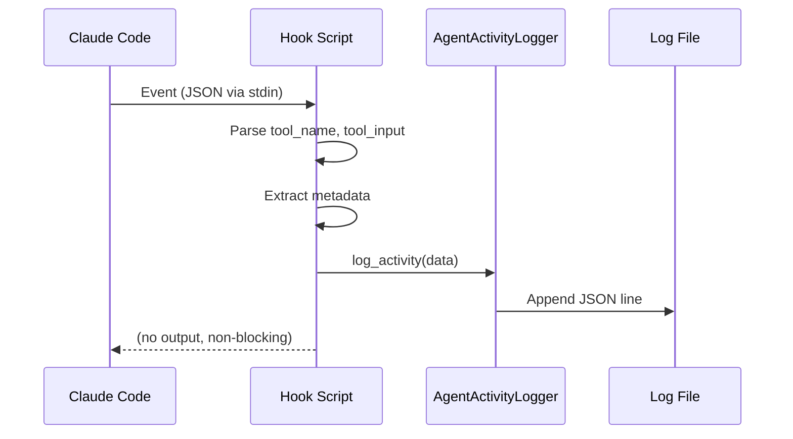
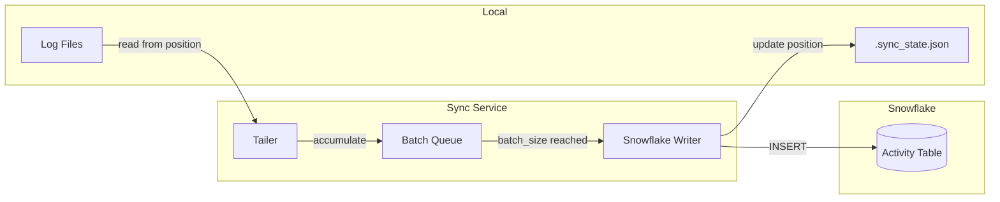
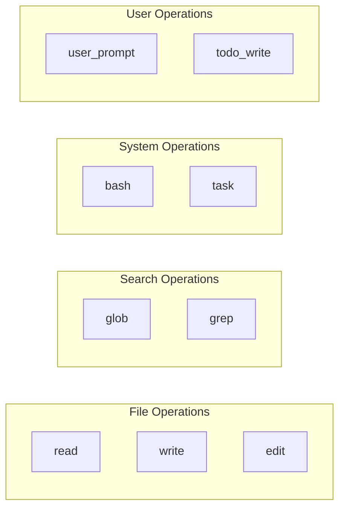
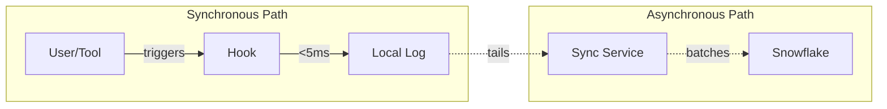

# Claude Code Activity Logging System

## Overview

An automatic activity logging system that captures all Claude Code tool operations and user prompts without manual intervention. Designed for session reconstruction, debugging, and agent context priming.

**Key Features:**
- Zero-overhead local logging (always enabled)
- Optional asynchronous Snowflake sync for enterprise environments
- Precomputed time fields for efficient querying
- Decoupled architecture - sync service runs independently

## Architecture



## Component Details

### 1. Hook Scripts (Synchronous, Fast)

Hooks intercept Claude Code events before execution:



| Hook | Trigger | Captures |
|------|---------|----------|
| `user-prompt-submit.py` | User sends message | Prompt text, length |
| `pre-tool-use.py` | Before any tool runs | Tool name, parameters, file paths |

### 2. Log Writer (`log_writer.py`)

Core logging engine with these responsibilities:

- **Daily log rotation**: `agent-activity-YYYY-MM-DD.log`
- **JSON Lines format**: One complete JSON object per line
- **Session tracking**: Consolidated `sessions.jsonl`
- **Error isolation**: Failures logged to `hook_errors.log`
- **Configurable path**: Local or absolute paths supported

### 3. Snowflake Sync Service (`snowflake_sync.py`)

Decoupled service that syncs local logs to Snowflake:



**Key characteristics:**
- Runs as separate process (no Claude Code overhead)
- Batches entries (default: 100) before writing
- Configurable flush interval (default: 60 seconds)
- Automatic retry with backoff on failures
- Tracks sync position across restarts

## Log Entry Schema

Each log entry contains precomputed fields for efficient querying:

```json
{
  "epoch": 1733839514,
  "date": "2025-12-10",
  "year": 2025,
  "month": 12,
  "day": 10,
  "hour": 14,
  "timestamp": "2025-12-10T14:25:14.123456Z",
  "time": "14:25:14",
  "operation": "bash",
  "prompt": "List directory contents",
  "session_id": "session-20251210-142514-a1b2c3d4",
  "cwd": "/path/to/project",
  "project": "my-project",
  "details": {
    "tool_name": "Bash",
    "command": "ls -la",
    "description": "List directory contents"
  }
}
```

### Field Reference

| Field | Type | Purpose |
|-------|------|---------|
| `epoch` | int | Unix timestamp for time-range queries |
| `date` | str | Daily filtering (`YYYY-MM-DD`) |
| `year`, `month`, `day`, `hour` | int | Aggregation without parsing |
| `timestamp` | str | Full ISO 8601 UTC timestamp |
| `operation` | str | Operation type (read, write, bash, grep, etc.) |
| `prompt` | str | Human-readable description |
| `cwd` | str | Working directory |
| `project` | str | Project name |
| `details` | obj | Tool-specific metadata |

### Operation Types



## Configuration

Located at `.claude/hooks/auto-logger-config.json`:

```json
{
  "enabled": true,
  "log_tool_operations": true,
  "log_user_prompts": true,
  "max_prompt_length": 500,
  "session_tracking": true,
  "log_level": "info",

  "destinations": {
    "local": {
      "enabled": true,
      "path": "logs"
    },
    "snowflake": {
      "enabled": false,
      "account": "your-account.region",
      "warehouse": "COMPUTE_WH",
      "database": "ANALYTICS",
      "schema": "CLAUDE_LOGS",
      "table": "CLAUDE_ACTIVITY_LOG",
      "auth": {
        "type": "key_pair",
        "user": "SERVICE_USER",
        "private_key_path": "/path/to/rsa_key.p8",
        "private_key_passphrase_env": "SNOWFLAKE_KEY_PASSPHRASE"
      },
      "sync": {
        "batch_size": 100,
        "flush_interval_seconds": 60,
        "retry_attempts": 3,
        "retry_delay_seconds": 5
      }
    }
  }
}
```

### Enabling/Disabling Snowflake Sync

| Setting | Effect |
|---------|--------|
| `destinations.snowflake.enabled: false` | Snowflake sync disabled (default) |
| `destinations.snowflake.enabled: true` | Snowflake sync enabled |

**Local logging is always enabled** - it cannot be disabled. Snowflake sync is an additional destination that runs asynchronously.

## Snowflake Sync Service Usage

### Installation

```bash
# Install dependencies (only needed for Snowflake sync)
pip install -r .claude/hooks/requirements-snowflake.txt
```

### Running the Sync Service

```bash
# Continuous sync (foreground)
python .claude/hooks/snowflake_sync.py

# Single sync pass
python .claude/hooks/snowflake_sync.py --once

# Preview what would sync (no writes)
python .claude/hooks/snowflake_sync.py --dry-run

# Log to file instead of stdout
python .claude/hooks/snowflake_sync.py --log-file sync.log

# Background with logging
python .claude/hooks/snowflake_sync.py --log-file .claude/logs/sync.log &
```

### Service Output

The sync service logs to stdout by default:

```
2025-12-10 14:25:14 - INFO - Starting continuous sync (interval: 60s)
2025-12-10 14:25:14 - INFO - Logs directory: /path/to/.claude/logs
2025-12-10 14:26:14 - INFO - Found 47 new entries
2025-12-10 14:26:15 - INFO - Inserted 47 rows into Snowflake
2025-12-10 14:26:15 - INFO - Synced 47 entries (total: 1523)
```

Use `--log-file` to persist logs when running as a background service.

### Snowflake Table Setup

Run the DDL in `.claude/hooks/snowflake_schema.sql`:

```sql
CREATE TABLE IF NOT EXISTS CLAUDE_ACTIVITY_LOG (
    epoch           NUMBER          NOT NULL,
    log_date        DATE            NOT NULL,
    log_year        NUMBER(4)       NOT NULL,
    log_month       NUMBER(2)       NOT NULL,
    log_day         NUMBER(2)       NOT NULL,
    log_hour        NUMBER(2)       NOT NULL,
    timestamp_utc   TIMESTAMP_NTZ   NOT NULL,
    time_local      VARCHAR(8),
    operation       VARCHAR(50)     NOT NULL,
    prompt          VARCHAR(2000),
    session_id      VARCHAR(100),
    cwd             VARCHAR(500),
    project         VARCHAR(100),
    details         VARIANT,
    source_file     VARCHAR(100),
    source_line     NUMBER,
    synced_at       TIMESTAMP_NTZ   DEFAULT CURRENT_TIMESTAMP()
);
```

## Query Examples

### Local (Python)

```python
import json
import time

def load_logs(filepath):
    with open(filepath, 'r') as f:
        return [json.loads(line) for line in f if line.strip()]

logs = load_logs('.claude/logs/agent-activity-2025-12-10.log')

# Last hour
cutoff = time.time() - 3600
recent = [e for e in logs if e['epoch'] > cutoff]

# Today's bash commands
bash_ops = [e for e in logs if e['operation'] == 'bash']

# Activity by hour
from collections import Counter
hourly = Counter(e['hour'] for e in logs)
```

### Snowflake (SQL)

```sql
-- Last hour of activity
SELECT * FROM CLAUDE_ACTIVITY_LOG
WHERE epoch > (EXTRACT(EPOCH FROM CURRENT_TIMESTAMP()) - 3600);

-- Today's activity by operation
SELECT operation, COUNT(*) as count
FROM CLAUDE_ACTIVITY_LOG
WHERE log_date = CURRENT_DATE()
GROUP BY operation
ORDER BY count DESC;

-- Extract bash commands from details
SELECT timestamp_utc, details:command::STRING as command
FROM CLAUDE_ACTIVITY_LOG
WHERE operation = 'bash'
ORDER BY epoch DESC
LIMIT 20;
```

## Data Flow Summary



| Path | Latency | Blocking |
|------|---------|----------|
| Local logging | <5ms | No |
| Snowflake sync | Async | No (separate process) |

## Hook Registration

Hooks are registered in `.claude/settings.local.json`:

```json
{
  "hooks": {
    "PreToolUse": [{
      "hooks": [{
        "type": "command",
        "command": "python .claude/hooks/pre-tool-use.py"
      }]
    }],
    "UserPromptSubmit": [{
      "hooks": [{
        "type": "command",
        "command": "python .claude/hooks/user-prompt-submit.py"
      }]
    }]
  }
}
```

## File Structure

```
.claude/
├── hooks/
│   ├── log_writer.py              # Core logging engine
│   ├── pre-tool-use.py            # Tool operation capture
│   ├── user-prompt-submit.py      # User prompt capture
│   ├── snowflake_sync.py          # Snowflake sync service
│   ├── snowflake_schema.sql       # Snowflake table DDL
│   ├── auto-logger-config.json    # Configuration
│   └── requirements-snowflake.txt # Snowflake dependencies
├── logs/
│   ├── agent-activity-*.log       # Daily activity logs
│   ├── sessions.jsonl             # Session metadata
│   ├── .sync_state.json           # Sync position tracking
│   └── hook_errors.log            # Error log
└── settings.local.json            # Hook registration
```

## Performance Characteristics

| Component | Latency | Impact on Claude Code |
|-----------|---------|----------------------|
| Hook execution | <5ms | Minimal |
| Local file write | <1ms | None |
| Snowflake sync | N/A | None (separate process) |

## Security Considerations

- **Local logs**: Stored in project directory, can be gitignored
- **Snowflake auth**: Key-pair authentication (no password in config)
- **Passphrase**: Stored in environment variable, not config file
- **Data in transit**: Snowflake connector uses TLS

## Use Cases

1. **Session Reconstruction**: Load recent logs to prime new agent with context
2. **Debugging**: Trace what operations led to an issue
3. **Analytics**: Understand tool usage patterns across team
4. **Audit Trail**: Centralized record of all operations
5. **Cross-project visibility**: Query activity across multiple projects in Snowflake
